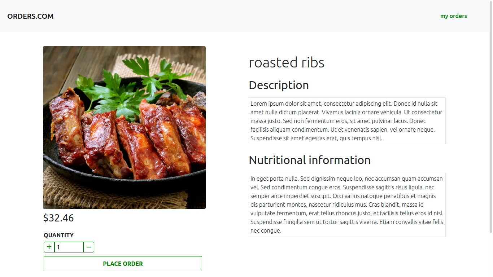
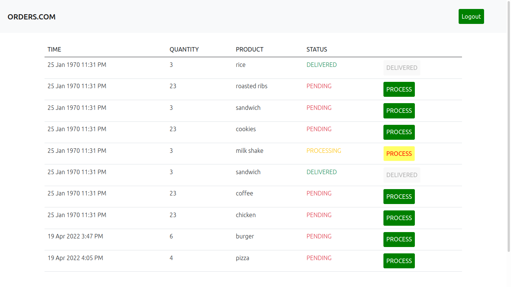
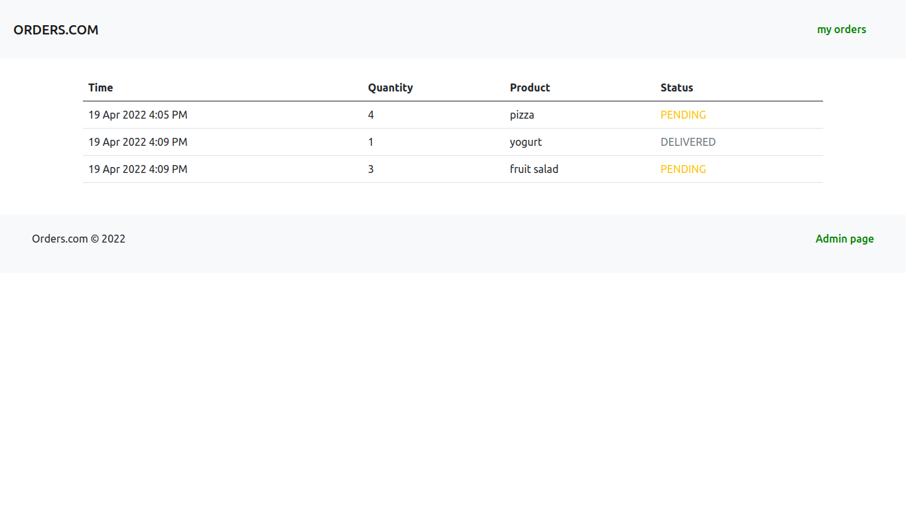

# Order placement application

***

## Table of contents
- [Previews](#previews)
- [Description](#description)
- [Usage](#usage)
- [Technologies](#technologies)

## Previews
> [Click here](http://ec2-54-147-218-130.compute-1.amazonaws.com/) for live demo
>
> **home page**
> 
>
> **product details**
> 
>
> **admin orders**
> 
>
> **customer orders**
> 

## Description
This is a simple order placing application\
It has two types of users
##### Customer
Can view products offered, place orders and view placed orders
##### Administrator
Performs processing of orders\
Admin login credentials can be found in [auth.txt](auth.txt)

## Usage
##### Prerequisites
- Java. Installation instructions can be found [here](https://www.java.com/en/download/help/download_options.html)
- Mysql. Installation instructions can be found [here](https://dev.mysql.com/doc/mysql-installation-excerpt/8.0/en/)

##### Configuration
Various environment variables can be configured through the properties file.\
Click [here](https://mkyong.com/java/java-properties-file-examples/) for more information on the properties file

##### Running the project
Clone the repository\
In terminal or command prompt, change directory to backend\
Run `./mvnw spring-boot run` for linux and mac and `.\mvnw.cmd spring-boot run` for windows

## Technologies
1. angular js for the frontend
2. java spring framework for the backend
3. mysql for the database
4. authentication is JWT based
